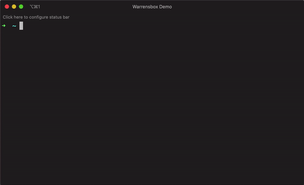
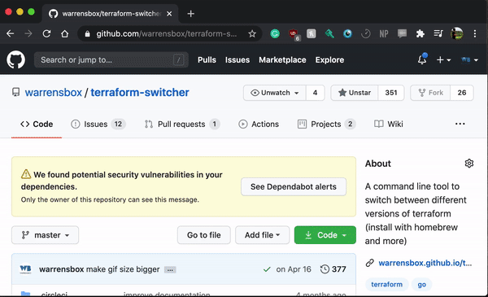

## Step-by-step instructions

An open source project becomes meaningful when people collaborate to improve the code. 

Feel free to look at the code, critique and make suggestions. Let's make `tfswitch` better!

## Required version
```sh
go version 1.22
```

### Step 1 - Create workspace
*Skip this step if you already have a GitHub go workspace*   
Create a GitHub workspace.



### Step 2 - Set GOPATH
*Skip this step if you already have a GitHub go workspace*    
Export your GOPATH environment variable in your `go` directory.   
```sh
export GOPATH=`pwd`
```


### Step 3 - Clone repository
Git clone this repository.  
```sh 
git clone git@github.com:warrensbox/terraform-switcher.git
```


### Step 4 - Get dependencies
Go get all the dependencies.   

```sh 
go mod download
```
```sh 
go get -v -t -d ./...
```
Test the code (optional).
```sh  
go vet -tests=false ./...
```
```sh 
go test -v ./...
```


### Step 5 - Build executable
Create a new branch.   
```sh 
git checkout -b feature/put-your-branch-name-here
```
Refactor and add new features to the code.  
Go build the code.   
```sh 
go build -o test-tfswitch
```
Test the code and create a new pull request!


### Contributors
Click <a href="https://github.com/warrensbox/terraform-switcher/graphs/contributors" target="_blank">here</a> to see all contributors.
