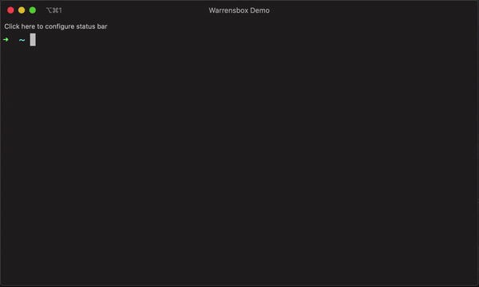

# Troubleshooting

## Permissions issues when installing tfswitch

* `install: can't change permissions of /usr/local/bin: Operation not permitted`
* `"Unable to remove symlink. You must have SUDO privileges"`
* `"Unable to create symlink. You must have SUDO privileges"`
* `install: cannot create regular file '/usr/local/bin/tfswitch': Permission denied`

Solution: You probably need to have privileges to install _tfswitch_ at `/usr/local/bin`

Try the following by installing `tfswtich` to your local bin directory instead:

```sh
mkdir -p "$HOME/.local/bin"
curl -L https://raw.githubusercontent.com/warrensbox/terraform-switcher/master/install.sh | bash -s -- -b "$HOME/.local/bin"
$HOME/.local/bin/tfswitch --version # test executable: should print the version of tfswitch
export PATH="$PATH:$HOME/.local/bin" # you should consider adding this to .bash_profile in your $HOME directory.

# Install Terraform 0.11.7 to $HOME/.local/bin/
tfswitch -b $HOME/.local/bin/terraform 0.11.7

# Invoke selection menu and install to $HOME/.local/bin/
tfswitch -b $HOME/.local/bin/terraform

```

See the custom directory option `-b`:  



## PGP signature verification error when installing Terraform 1.14.9+

When installing Terraform 1.14.9 or later using _tfswitch_ v1.16.0 or earlier,
or after upgrading to v1.17.0+ without clearing the locally cached HashiCorp
PGP key:

```sh
ERROR Could not verify PGP signature using key №1 (out of 1): Signature Verification Error: Invalid signature caused by openpgp: key expired
FATAL Error downloading: Unable to verify checksum signature against PGP key
```

Solution: Your locally cached copy of HashiCorp's PGP public key is stale.
Starting with Terraform 1.14.9, HashiCorp began signing releases with a
refreshed key block after the original key block expired. This was fixed in
_tfswitch_[v1.17.0](https://github.com/warrensbox/terraform-switcher/releases/tag/v1.17.0)
and [v1.17.1](https://github.com/warrensbox/terraform-switcher/releases/tag/v1.17.1),
but upgrading alone is not enough — if _tfswitch_ had already cached the key
before that point, the stale single-block file remains on disk and the same
error persists. Delete (rename to preserve just in case) the cached file so
_tfswitch_ re-downloads the current key:

```sh
mv ~/.terraform.versions/terraform_72D7468F.asc ~/.terraform.versions/terraform_72D7468F.asc.old
tfswitch <version>
```
