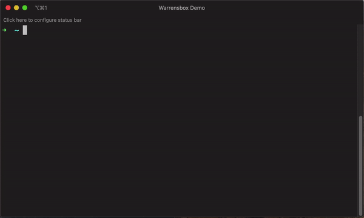

## Use dropdown menu to select version


1.  You can switch between different versions of terraform by typing the command `tfswitch` on your terminal.
2.  Select the version of terraform you require by using the up and down arrow.
3.  Hit **Enter** to select the desired version.

The most recently selected versions are presented at the top of the dropdown.

## Supply version on command line


1. You can also supply the desired version as an argument on the command line.
2. For example, `tfswitch 0.10.5` for version 0.10.5 of terraform.
3. Hit **Enter** to switch.

## See all versions including beta, alpha and release candidates(rc)


1. Display all versions including beta, alpha and release candidates(rc).
2. For example, `tfswitch -l` or `tfswitch --list-all` to see all versions.
3. Hit **Enter** to select the desired version.

## Use environment variables

You can also set environment variables for tfswitch to override some configurations:

### `TF_VERSION`

`TF_VERSION` environment variable can be set to your desired terraform version.

For example:

```bash
export TF_VERSION="0.14.4"
tfswitch # Will automatically switch to terraform version 0.14.4
```

### `TF_DEFAULT_VERSION`

`TF_DEFAULT_VERSION` environment variable can be set to your desired terraform version that will be used as a fallback version, if not other sources are found.

For example:

```bash
export TF_DEFAULT_VERSION="0.14.4"
tfswitch # Will automatically switch to terraform version 0.14.4
```

### `TF_PRODUCT`

`TF_PRODUCT` environment variable can be set to your desired product/tool.

This can either be set to:

 * `terraform`
 * `opentofu`

For example:

```bash
export TF_PRODUCT="opentofu"
tfswitch # Will install opentofu instead of terraform
```

### `TF_LOG_LEVEL`

`TF_LOG_LEVEL` environment variable can be set to override default log level.

- Supported log levels:
  - `INFO`:   includes `PANIC`, `FATAL`, `ERROR`
  - `ERROR`:  includes `PANIC`, `FATAL`, `ERROR`, `WARN`, `INFO`
  - `NOTICE`: includes `PANIC`, `FATAL`, `ERROR`, `WARN`, `NOTICE`, `INFO`
  - `DEBUG`:  includes `PANIC`, `FATAL`, `ERROR`, `WARN`, `NOTICE`, `INFO`, `DEBUG`
  - `TRACE`:  includes `PANIC`, `FATAL`, `ERROR`, `WARN`, `NOTICE`, `INFO`, `DEBUG`, `TRACE`
  - Any other log level value falls under default logging level

For example:

```bash
export TF_LOG_LEVEL="DEBUG"
tfswitch # Will output debug logs
```

### `TF_ARCH`

`TF_ARCH` environment variable can be set to override default CPU architecture of downloaded binaries.

- This can be set to any string, though incorrect values will result in download failure.
- Suggested values: `amd64`, `arm64`, `386`.
- Check available Arch types at:
  - [Terraform Downloads](https://releases.hashicorp.com/terraform/)
  - [OpenTofu Downloads](https://get.opentofu.org/tofu/)

For example:

```bash
export TF_ARCH="amd64"
tfswitch # Will install binary for amd64 architecture
```

### `TF_BINARY_PATH`

`tfswitch` defaults to install to the `/usr/local/bin/` directory (and falls back to `$HOME/bin/` otherwise). The target filename is resolved automatically based on the `product` parameter.  
`TF_BINARY_PATH` environment variable can be set to specify a **full installation path** (directory + file name). If target directory does not exist, `tfswitch` falls back to `$HOME/bin/` directory.

For example:

```bash
export TF_BINARY_PATH="$HOME/bin/terraform" # Path to the file
tfswitch # Will install binary as $HOME/bin/terraform
```

### `TF_INSTALL_PATH`

`tfswitch` defaults to download binaries to the `$HOME/.terraform.versions/` directory.  
`TF_INSTALL_PATH`environment variable can be set to specify a parent directory for `.terraform.versions` directory. Current user must have write permissions to the target directory. If the target directory does not exist, `tfswitch` will create it.

For example:

```bash
export TF_INSTALL_PATH="/tmp" # Path to the directory where `.terraform.versions` directory resides
tfswitch # Will download actual binary to /tmp/.terraform.versions/
```

## Install latest version only

1. Install the latest stable version only.
2. Run `tfswitch -u` or `tfswitch --latest`.
3. Hit **Enter** to install.

## Install latest implicit version for stable releases

1. Install the latest implicit stable version.
2. Ex: `tfswitch -s 0.13` or `tfswitch --latest-stable 0.13` downloads 0.13.6 (latest) version.
3. Hit **Enter** to install.

## Install latest implicit version for beta, alpha and release candidates(rc)

1. Install the latest implicit pre-release version.
2. Ex: `tfswitch -p 0.13` or `tfswitch --latest-pre 0.13` downloads 0.13.0-rc1 (latest) version.
3. Hit **Enter** to install.

## Show latest version only

1. Just show what the latest version is.
2. Run `tfswitch -U` or `tfswitch --show-latest`
3. Hit **Enter** to show.

## Show latest implicit version for stable releases

1. Show the latest implicit stable version.
2. Ex: `tfswitch -S 0.13` or `tfswitch --show-latest-stable 0.13` shows 0.13.6 (latest) version.
3. Hit **Enter** to show.

## Show latest implicit version for beta, alpha and release candidates(rc)

1. Show the latest implicit pre-release version.
2. Ex: `tfswitch -P 0.13` or `tfswitch --show-latest-pre 0.13` shows 0.13.0-rc1 (latest) version.
3. Hit **Enter** to show.

## Use custom mirror

To install from a remote mirror other than the default(https://releases.hashicorp.com/terraform). Use the `-m` or `--mirror` parameter.

```bash
tfswitch --mirror https://example.jfrog.io/artifactory/hashicorp`
```

## Install to non-default location

By default `tfswitch` will download the Terraform binary to the user home directory under this path: `$HOME/.terraform.versions`

If you want to install the binaries outside of the home directory then you can provide the `-i` or `--install` to install Terraform binaries to a non-standard path. Useful if you want to install versions of Terraform that can be shared with multiple users.

The Terraform binaries will then be placed in the directory `.terraform.versions` under the custom install path e.g. `/opt/terraform/.terraform.versions`

```bash
tfswitch -i /opt/terraform
```

**NOTE**: The directory passed in `-i`/`--install` must be created before running `tfswitch`

## Install binary for non-default architecture

By default `tfswitch` will download the binary for the architecture of the host machine.

If you want to download the binary for non-default CPU architecture then you can provide the `-A` or `--arch` command line argument to download binaries for custom CPU architecture. Useful if you need to override binary architecture for whatever reason.

```bash
tfswitch --arch amd64
```

**NOTE**: If the target file already exists in the download directory (See [Install to non-default location](#install-to-non-default-location) section above), it will be not downloaded. Downloaded files are stored without the architecture in the filename. Format of the filenames in download directory: `<product>_<version>`. E.g. `terraform_1.10.4`.
