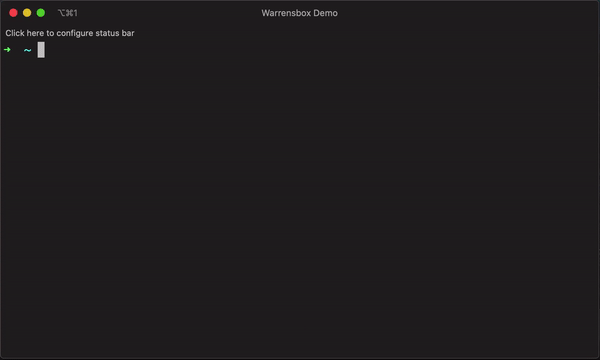
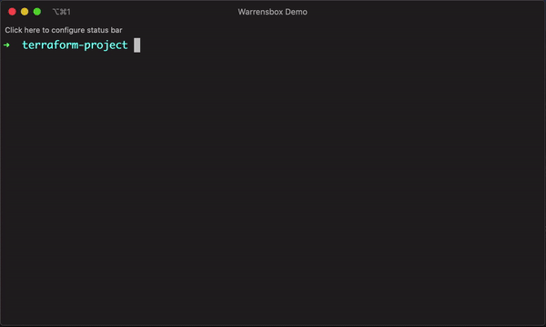

## Get the version from a subdirectory

While using the file configuration it might be necessary to change the working directory. You can do that with the `--chdir` or `-c` parameter.

```bash
tfswitch --chdir terraform_dir
tfswitch -c terraform_dir
```

## Use `version.tf` file

If a `.tf` file with the version constraints is included in the current directory, `tfswitch` should automatically download or switch to that terraform version.  
Also please refer to [Order of Terraform version definition precedence](general.md) page for more information on how `tfswitch` determines the version to use.  
For example, the following should automatically switch to the latest available version newer than `0.12.8`:  

```hcl
terraform {
  required_version = ">= 0.12.9"

  required_providers {
    aws        = ">= 2.52.0"
    kubernetes = ">= 1.11.1"
  }
}
```


## Use `.tfswitchrc` file


1. Create a `.tfswitchrc` file containing the desired version
2. For example, `echo "0.10.5" >> .tfswitchrc` for version `0.10.5`
3. Run the command `tfswitch` in the same directory as this `.tfswitchrc` file

*Instead of a `.tfswitchrc` file, a `.terraform-version` file may be used for compatibility with [`tfenv`](https://github.com/tfutils/tfenv#terraform-version-file) and other tools which use it*

## Use `.tfswitch.toml` file  (For non-admin users with limited privilege on their computers)

`tfswitch` defaults to install to the `/usr/local/bin/` directory (and falls back to `$HOME/bin/` otherwise). The target filename is resolved automatically based on the `product` attribute ([see below](#setting-product-using-tfswitchtoml-file)). If you do not have write access to `/usr/local/bin/` directory, you can use the `.tfswitch.toml` file to specify a **full installation path** (directory + file name).  
This is similar to using a `.tfswitchrc` file, but you specify a custom binary path for the installation:




1. Create a directory for the custom binary path. Ex: `mkdir -p "$HOME/bin/"`
2. Add the path to the directory to your `PATH` environment variable. Ex: `export PATH="$PATH:$HOME/bin"` (add this to your Bash profile or Zsh profile)
3. Pass `-b` or `--bin` parameter with the custom binary path as value (this must be a first level pointer inside the directory from above). Ex: `tfswitch -b "$HOME/bin/terraform" 0.10.8`
   - If target directory for custom binary path does not exist, `tfswitch` falls back to `$HOME/bin/` directory
4. Optionally, you can create a `.tfswitch.toml` file in your home directory (`~/.tfswitch.toml`)
5. Your `~/.tfswitch.toml` file should look like this:

```toml
bin = "$HOME/bin/terraform"
version = "0.11.3"
```

6. Run `tfswitch` and it should automatically install the required version in the specified binary path

Below is an example for `$HOME/.tfswitch.toml` on Windows:

```toml
bin = "C:\\Users\\<%USRNAME%>\\bin\\terraform.exe"
```

## Setting the default (fallback) version using `.tfswitch.toml` file

If `tfswsitch` is unable to determine the version to use, it errors out.  
The `.tfswitch.toml` file can be configured with a `default-version` attribute for `tfswitch` to use a particular version, if no other sources of versions are found

```toml
default-version = "1.5.4"
```

## Setting product using `.tfswitch.toml` file

`tfswitch` defaults to install Terraform binaries.  
The `.tfswitch.toml` file can be configured with a `product` attribute for `tfswitch` to use either Terraform or OpenTofu by default:

```toml
product = "opentofu"
```

or

```toml
product = "terraform"
```

## Setting log level using `.tfswitch.toml` file

`tfswitch` defaults to `INFO` log level.  
The `.tfswitch.toml` file can be configured with a `log-level` attribute for `tfswitch` to use non-default logging verbosity:

```toml
log-level = "INFO"
```

- Supported log levels:
  - `ERROR`:  includes `PANIC`, `FATAL`, `ERROR`
  - `INFO`:   includes `PANIC`, `FATAL`, `ERROR`, `WARN`, `INFO` (default)
  - `NOTICE`: includes `PANIC`, `FATAL`, `ERROR`, `WARN`, `NOTICE`, `INFO`
  - `DEBUG`:  includes `PANIC`, `FATAL`, `ERROR`, `WARN`, `NOTICE`, `INFO`, `DEBUG`
  - `TRACE`:  includes `PANIC`, `FATAL`, `ERROR`, `WARN`, `NOTICE`, `INFO`, `DEBUG`, `TRACE`
  - Any other log level value falls under default logging level

## Overriding CPU architecture type for the downloaded binary using `.tfswitch.toml` file

CPU architecture of the downloaded binaries defaults to `tfswitch`'s host architecture.  
The `.tfswitch.toml` file can be configured with a `arch` attribute for `tfswitch` to download binary of non-default architecture type:

```toml
arch = "arm64"
```

- This can be set to any string, though incorrect values will result in download failure.
- Suggested values: `amd64`, `arm64`, `386`.
- Check available Arch types at:
  - [Terraform Downloads](https://releases.hashicorp.com/terraform/)
  - [OpenTofu Downloads](https://get.opentofu.org/tofu/)

## Overriding installation directory, where actual binaries are stored, using `.tfswitch.toml` file

`tfswitch` defaults to download binaries to the `$HOME/.terraform.versions/` directory.  
The `.tfswitch.toml` file can be configured with a `install` attribute to specify the parent directory for `.terraform.versions` directory.

```toml
install = "/var/cache"
```

**NOTE**:
- Current user must have write permissions to the target directory
- If the target directory does not exist, `tfswitch` will create it

## Use `terragrunt.hcl` file

If a terragrunt.hcl file with the terraform constraint is included in the current directory, it should automatically download or switch to that terraform version.  
For example, the following should automatically switch Terraform to the latest version 0.13:

```hcl
terragrunt_version_constraint = ">= 0.26, < 0.27"
terraform_version_constraint  = ">= 0.13, < 0.14"
...
```
