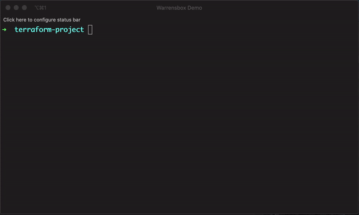

<!-- markdownlint-disable MD041 -->

## Get the version from a subdirectory

While using the file configuration it might be necessary to change the working
directory. You can do that with the `--chdir` or `-c` parameter.

```bash
tfswitch --chdir terraform_dir
tfswitch -c terraform_dir
```

## Use `version.tf` file

If a `.tf` file with the version constraints is included in the current
directory, `tfswitch` should automatically download or switch to that terraform
version.  
Also please refer to [Order of Terraform version definition
precedence](general.md) page for more information on how `tfswitch` determines
the version to use.  
For example, the following should automatically switch to the latest available
version newer than `0.12.8`:

```hcl
terraform {
  required_version = ">= 0.12.9"

  required_providers {
    aws        = ">= 2.52.0"
    kubernetes = ">= 1.11.1"
  }
}
```



## Use `.tfswitchrc` file


1. Create a `.tfswitchrc` file containing the desired version
2. For example, `echo "0.10.5" >> .tfswitchrc` for version `0.10.5`
3. Run the command `tfswitch` in the same directory as this `.tfswitchrc` file

_Instead of a `.tfswitchrc` file, a `.terraform-version` file may be used for
compatibility with
[`tfenv`](https://github.com/tfutils/tfenv#terraform-version-file) and other
tools which use it_

## Use `.tfswitch.toml` file

### Installing to a custom path (for non-admin users with limited privilege on their computers)

`tfswitch` defaults to install to the `/usr/local/bin/` directory (and falls
back to `$HOME/bin/` otherwise). The target filename is resolved automatically
based on the `product` parameter ([see below](#setting-product-base-tool-name)).  
If you do not have write access to `/usr/local/bin/` directory, you can use the
`.tfswitch.toml` file to specify a **full installation path** (directory +
filename) Ex: `$HOME/bin/terraform`  
This is similar to using a `.tfswitchrc` file, but you specify a custom binary
path for the installation:


1. Create a directory for the custom binary path. Ex: `mkdir -p "$HOME/bin/"`
2. Add the path to the directory to your `PATH` environment variable. Ex:
   `export PATH="$PATH:$HOME/bin"` (add this to your Bash profile or Zsh
   profile)
3. Pass `-b` or `--bin` parameter with the custom binary path as value (this
   must be a first level pointer inside the directory from above). Ex:
   `tfswitch -b "$HOME/bin/terraform" 0.10.8`  
   • If target directory for custom binary path does not exist, `tfswitch`
   falls back to `$HOME/bin/` directory
4. Optionally, you can create a `.tfswitch.toml` file in your home directory
   (`~/.tfswitch.toml`)
5. Your `~/.tfswitch.toml` file should have a line like this:
   `bin = "$HOME/bin/terraform"`
6. Run `tfswitch` and it should automatically install the required version in
   the specified binary path

Below is an example for `$HOME/.tfswitch.toml` on Windows:

```toml
bin = "C:\\Users\\<%USERNAME%>\\bin\\terraform.exe"
```

### Setting default (fallback) version

By default, if `tfswitch` is unable to determine the version to use, it errors
out.  
The `.tfswitch.toml` file can be configured with a `default-version` parameter
for `tfswitch` to use a particular version, if no other sources of versions are
found

```toml
default-version = "1.5.4"
```

### Setting product (base tool) name

`tfswitch` defaults to install Terraform binaries.  
The `.tfswitch.toml` file can be configured with a `product` parameter for
`tfswitch` to use either Terraform or OpenTofu by default:

```toml
product = "opentofu"
```

or

```toml
product = "terraform"
```

### Setting log level

`tfswitch` defaults to `INFO` log level.  
The `.tfswitch.toml` file can be configured with a `log-level` parameter for
`tfswitch` to use non-default logging verbosity:

```toml
log-level = "INFO"
```

- Supported log levels:
  - `ERROR`: includes `PANIC`, `FATAL`, `ERROR`
  - `INFO`: includes `PANIC`, `FATAL`, `ERROR`, `WARN`, `INFO` (default)
  - `NOTICE`: includes `PANIC`, `FATAL`, `ERROR`, `WARN`, `NOTICE`, `INFO`
  - `DEBUG`: includes `PANIC`, `FATAL`, `ERROR`, `WARN`, `NOTICE`, `INFO`, `DEBUG`
  - `TRACE`: includes `PANIC`, `FATAL`, `ERROR`, `WARN`, `NOTICE`, `INFO`, `DEBUG`, `TRACE`
  - Any other log level value falls under default logging level

### Overriding CPU architecture type for the downloaded binary

CPU architecture of the downloaded binaries defaults to `tfswitch`'s host
architecture.  
The `.tfswitch.toml` file can be configured with a `arch` parameter for
`tfswitch` to download binary of the CPU architecture that doesn't match the
host:

```toml
arch = "arm64"
```

- This can be set to any string, though incorrect values will result in
  download failure.
- Suggested values: `amd64`, `arm64`, `386`.
- Check available Arch types at:
  - [Terraform Downloads](https://releases.hashicorp.com/terraform/)
  - [OpenTofu Downloads](https://get.opentofu.org/tofu/)

### Overriding installation directory, where actual binaries are stored

`tfswitch` defaults to download binaries to the `$HOME/.terraform.versions/`
directory.  
The `.tfswitch.toml` file can be configured with a `install` parameter to
specify the parent directory for `.terraform.versions` directory.

```toml
install = "/var/cache"
```

**NOTE**:

- Current user must have write permissions to the target directory
- If the target directory does not exist, `tfswitch` will create it

### Disabling color output / Forcing color output

`tfswitch` defaults to color output if the terminal supports it and if the TTY
is allocated (interactive session).

Disabling color output can be useful in non-interactive sessions, such as when
running scripts in CI/CD pipeline or when piping output to other commands.

- If you want to disable color output, you can use the `no-color` parameter.
- If you want to force color output even if the TTY is not allocated
  (non-interactive session), you can use the `force-color` parameter.

**NOTE**: `no-color` and `force-color` parameters are mutually exclusive.

## Use `terragrunt.hcl` file

If a terragrunt.hcl file with the terraform constraint is included in the
current directory, it should automatically download or switch to that terraform
version.  
For example, the following should automatically switch Terraform to the latest
version 0.13:

```hcl
terragrunt_version_constraint = ">= 0.26, < 0.27"
terraform_version_constraint  = ">= 0.13, < 0.14"
…
```
